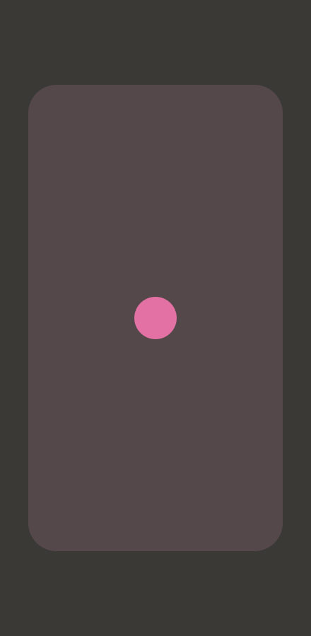
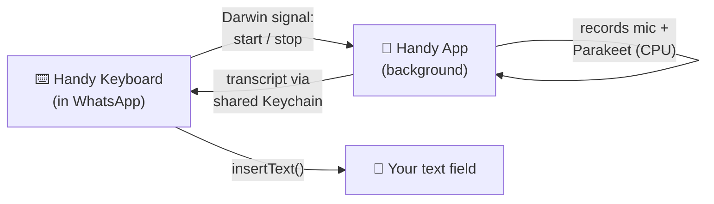

<div align="center">


# Handy for iOS

### 🎙️ Free, open-source, **on-device** voice dictation for iPhone — speak into any text field.

*The offline speech-to-text keyboard iOS was never supposed to let you build.*

<br/>

[](https://developer.apple.com)
[](#)
[](https://huggingface.co/handy-computer)
[](LICENSE)

</div>

---

## What is this?

**Handy for iOS** is a custom keyboard that turns your voice into text **entirely on your iPhone** — no cloud, no accounts, no API keys, nothing leaves your device. Tap the mic, talk, and your words appear right in WhatsApp, Notes, Messages, or any app with a text field.

It's an iOS port of the beloved desktop app [**Handy**](https://github.com/cjpais/handy) (`handy.computer`), powered by NVIDIA's open-source **Parakeet** speech model running locally via [`transcribe.cpp`](https://github.com/handy-computer/transcribe.cpp) (ggml).

> 🧠 **Why did this not exist already?** Because iOS makes it *genuinely hard* — Apple blocks keyboards from using the microphone at all. Getting this working meant defeating a stack of iOS background restrictions one by one (mic, GPU, and pasteboard). [Jump to the story ↓](#-the-part-apple-didnt-want-you-to-build)

<br/>

<div align="center">

### 📸 Screenshots

<!-- Drop your screenshots here (Landing · Model picker · Keyboard · Dictation). -->
<table>
<tr>
<td align="center"><br/><sub><b>Landing</b></sub></td>
<td align="center"><br/><sub><b>Pick a model</b></sub></td>
<td align="center"><br/><sub><b>Dictate anywhere</b></sub></td>
</tr>
</table>

</div>

---

## ✨ Features

- 🔒 **100% private & offline** — audio never leaves your iPhone. No servers, no telemetry.
- ⌨️ **Works in any app** — it's a system keyboard; dictate into WhatsApp, Notes, Slack, email…
- 🧩 **Open models** — Parakeet Unified (Q4 / Q8). Pick speed vs. accuracy.
- 🎨 **Handy-branded** — the friendly waving-hand look, pink and warm.
- 🌊 **Live dictation bar** — tap mic → ✕ cancel · animated waveform · ✓ confirm.
- 🪄 **Seamless** — records in the background and inserts text in place; **no app-switching**.
- 🆓 **Free & MIT-licensed** — fork it, ship it, make it yours.

---

## 🚀 How you use it

1. **Open Handy**, download a Parakeet model (once), and enable the keyboard in **Settings → General → Keyboard → Keyboards → Add New Keyboard → Handy** (turn on *Allow Full Access*).
2. Grant microphone permission.
3. In any app, switch to the **Handy keyboard** and tap the **mic**.
4. **Speak** → pause → your text appears right where your cursor is. ✨

---

## 🧨 The part Apple didn't want you to build

Making an on-device dictation keyboard on iOS is a boss fight against the OS. Every one of these was hit — and solved — in this repo:

| iOS restriction | What breaks | How Handy-iOS beats it |
|---|---|---|
| 🎤 **Keyboards can't use the mic** | `AVAudioRecorder.record()` returns false in a keyboard extension | Recording happens in the **main app**, triggered by the keyboard |
| 😴 **Backgrounded apps get suspended** | App frozen → can't respond to the keyboard | Keeps alive with an **inaudible audio stream** (background audio) |
| 🚫 **Can't *start* the mic in the background** | "voice capture could not be completed" | **Persistent mic session** kept warm while the app runs |
| 🖥️ **No GPU/Metal in the background** | `Insufficient Permission (to submit GPU work from background)` | Inference runs on **CPU** (Parakeet 0.6B is small & fast) |
| 📋 **No pasteboard in the background** | "pasteboard not available at this time" | Transcript handed over via a **shared Keychain group** |

The result: tap the keyboard mic, speak, and text lands in your chat box — the app doing all the work quietly in the background.

---

## 🏗️ Architecture



- **Frontend:** SwiftUI app + UIKit keyboard extension.
- **Inference:** [`transcribe.cpp`](https://github.com/handy-computer/transcribe.cpp) (ggml) compiled to a static lib for iOS; Parakeet GGUF models.
- **IPC:** Darwin notifications (trigger) + shared Keychain (result) — no App Group needed.

---

## 🛠️ Build it yourself

```bash
git clone --recurse-submodules https://github.com/harshuljain13/Handy-ios.git
cd Handy-ios

# 1. Compile the Parakeet inference library for iOS (needs cmake + Xcode)
bash scripts/build_transcribe_ios.sh

# 2. Generate the Xcode project (needs xcodegen: brew install xcodegen)
xcodegen generate

# 3. Open, set your signing Team on both targets, and run on a device
open handy-ios.xcodeproj
```

Requirements: iOS 17+, Xcode 16+, an Apple ID for signing, and a real device (the keyboard + mic don't work in the Simulator).

---

## 🙏 Credits

- [**Handy**](https://github.com/cjpais/handy) by [@cjpais](https://github.com/cjpais) — the original cross-platform app and the whole idea.
- [**transcribe.cpp**](https://github.com/handy-computer/transcribe.cpp) & [**handy-computer**](https://huggingface.co/handy-computer) — the ggml STT engine and hosted GGUF models.
- **NVIDIA Parakeet** — the speech recognition model family.

## 📄 License

MIT — see [LICENSE](LICENSE). Built in the same spirit as Handy: *accessibility tooling belongs in everyone's hands.*

<div align="center">
<br/>
<br/>
<sub>Made with 🩷 for people who'd rather talk than type.</sub>
</div>
