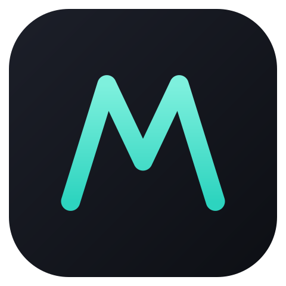
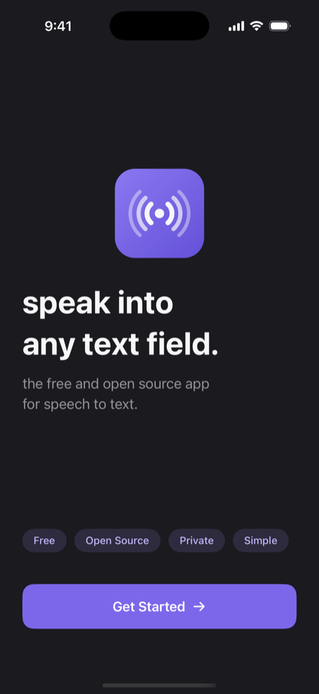
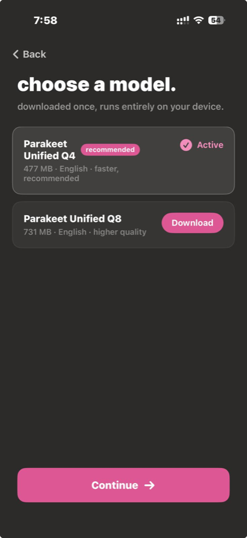
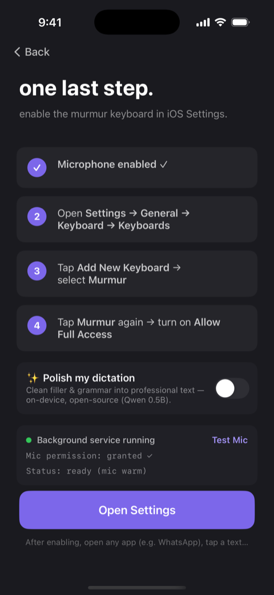
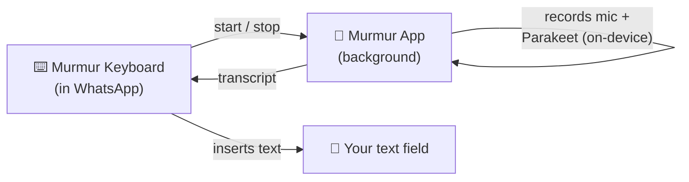
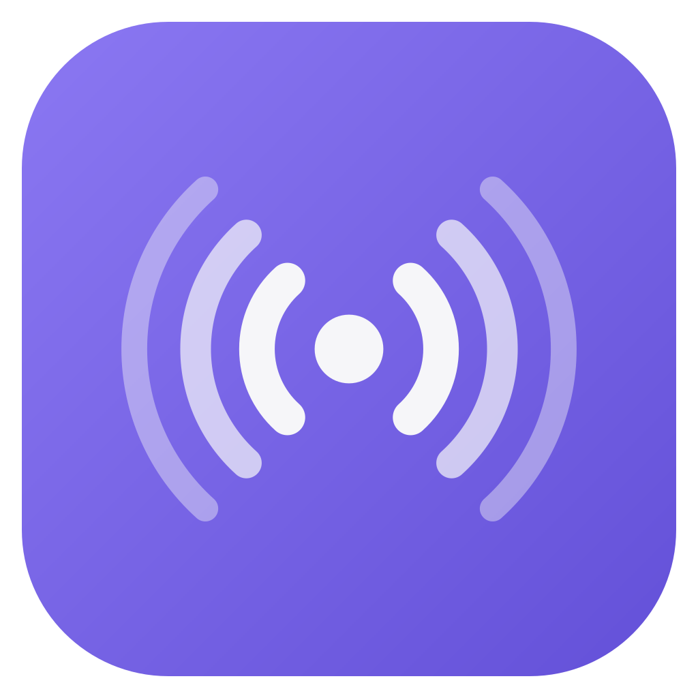

<div align="center">



# Murmur for iOS

### 🎙️ Free, open-source, **on-device** voice dictation for iPhone.
**Speak into any text field — 100% offline.**

<br/>

[](https://developer.apple.com)
[](#)
[](https://huggingface.co/handy-computer)
[](LICENSE)

</div>

---

## What is this?

**Murmur for iOS** is a custom keyboard that turns your voice into text **entirely on your iPhone** — no cloud, no accounts, no API keys, nothing ever leaves your device. Tap the mic, talk, and your words land right in WhatsApp, Notes, Messages, or any app with a text field.

It's an iOS port of the beloved desktop app [**Handy**](https://github.com/cjpais/handy) (`handy.computer`), powered by NVIDIA's open-source **Parakeet** speech model running locally via [`transcribe.cpp`](https://github.com/handy-computer/transcribe.cpp) (ggml).

<br/>

<div align="center">

<table>
<tr>
<td align="center"><br/><sub><b>Speak into any text field</b></sub></td>
<td align="center"><br/><sub><b>Pick a model — runs on-device</b></sub></td>
<td align="center"><br/><sub><b>Set up in a tap</b></sub></td>
</tr>
</table>

</div>

---

## ✨ Features

- 🔒 **100% private & offline** — audio never leaves your iPhone. No servers, no telemetry.
- ⌨️ **Works in any app** — it's a system keyboard; dictate into WhatsApp, Notes, Slack, email…
- 🧩 **Open models** — Parakeet Unified **Q4** (477 MB, faster) or **Q8** (731 MB, higher quality).
- 🌊 **Clean dictation UI** — tap the mic → the panel becomes an animated waveform with ✕ cancel and ✓ confirm.
- 🪄 **Seamless** — records in the background and inserts text in place; **no app-switching, no copy-paste**.
- 🎨 **Calm, focused UI** — a dark neutral canvas with a violet accent; the ripple mark pulses while you speak.
- 🆓 **Free & MIT-licensed** — fork it, ship it, make it yours.

---

## 🚀 How to use it

1. **Open Murmur** and download a Parakeet model (once).
2. **Allow the microphone** when asked.
3. Enable the keyboard: **Settings → General → Keyboard → Keyboards → Add New Keyboard → Murmur**, then tap **Murmur → Allow Full Access**.
4. In any app, switch to the **Murmur keyboard**, tap the **mic**, and **speak** → your text appears right where the cursor is. ✨

---

## 🏗️ How it works



- **App:** SwiftUI onboarding + model management. **Keyboard:** a lightweight UIKit extension.
- **Inference:** [`transcribe.cpp`](https://github.com/handy-computer/transcribe.cpp) (ggml) compiled to a static library for iOS, running Parakeet GGUF models.
- **All on-device.** The keyboard triggers the app to record and transcribe, then inserts the result in place.

---

## 🛠️ Build it yourself

```bash
git clone --recurse-submodules https://github.com/harshuljain13/murmur-ios.git
cd murmur-ios

# 1. Compile the Parakeet inference library for iOS (needs cmake + Xcode)
bash scripts/build_transcribe_ios.sh

# 2. Compile the on-device Polish model library (llama.cpp → libmurmurllm.a)
bash scripts/build_llama_ios.sh

# 3. Generate the Xcode project (needs xcodegen: brew install xcodegen)
xcodegen generate

# 4. Open, set your signing Team on both targets, and run on a device
open murmur-ios.xcodeproj
```

Requirements: **iOS 17+**, **Xcode 16+**, an Apple ID for signing, and a **real device** (the keyboard + microphone don't work in the Simulator).

---

## 🙏 Credits

- [**Handy**](https://github.com/cjpais/handy) by [@cjpais](https://github.com/cjpais) — the original cross-platform app and the whole idea.
- [**transcribe.cpp**](https://github.com/handy-computer/transcribe.cpp) & [**handy-computer**](https://huggingface.co/handy-computer) — the ggml STT engine and hosted GGUF models.
- **NVIDIA Parakeet** — the speech recognition model family.

## 📄 License

MIT — see [LICENSE](LICENSE). Built in the same spirit as Handy: *accessibility tooling belongs in everyone's hands.*

<div align="center">
<br/>
<br/>
<sub>Made with 💜 for people who'd rather talk than type.</sub>
</div>
